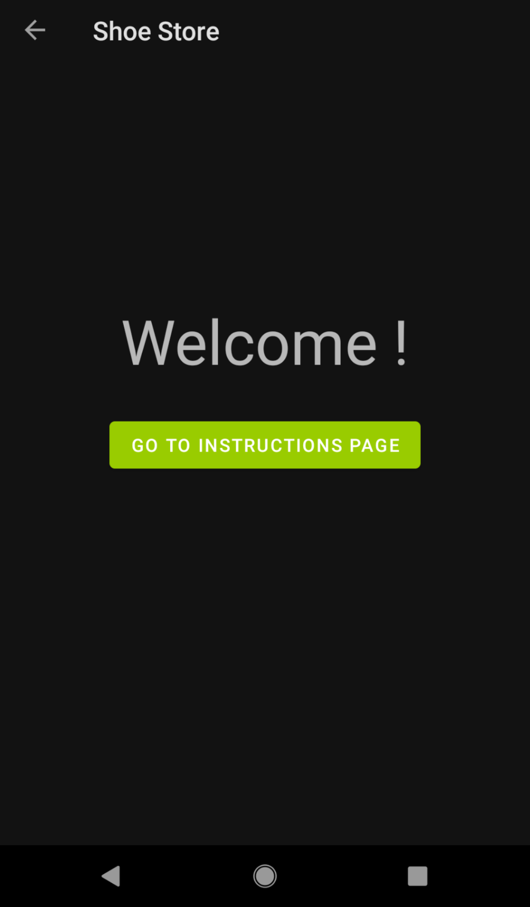
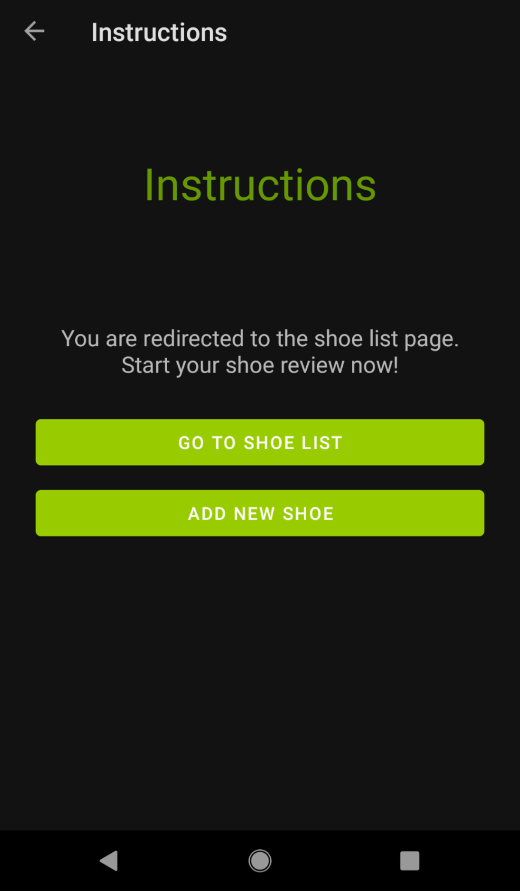
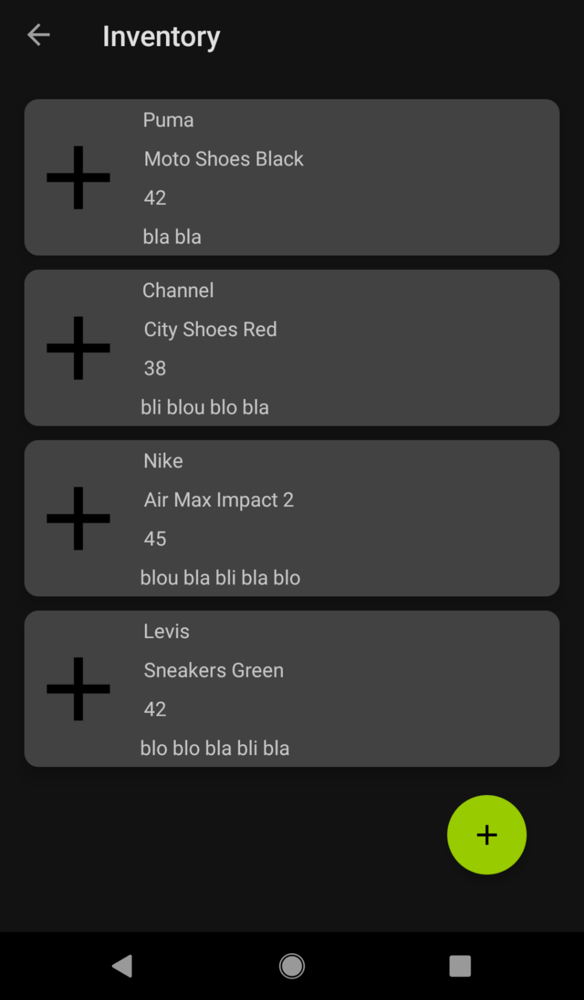
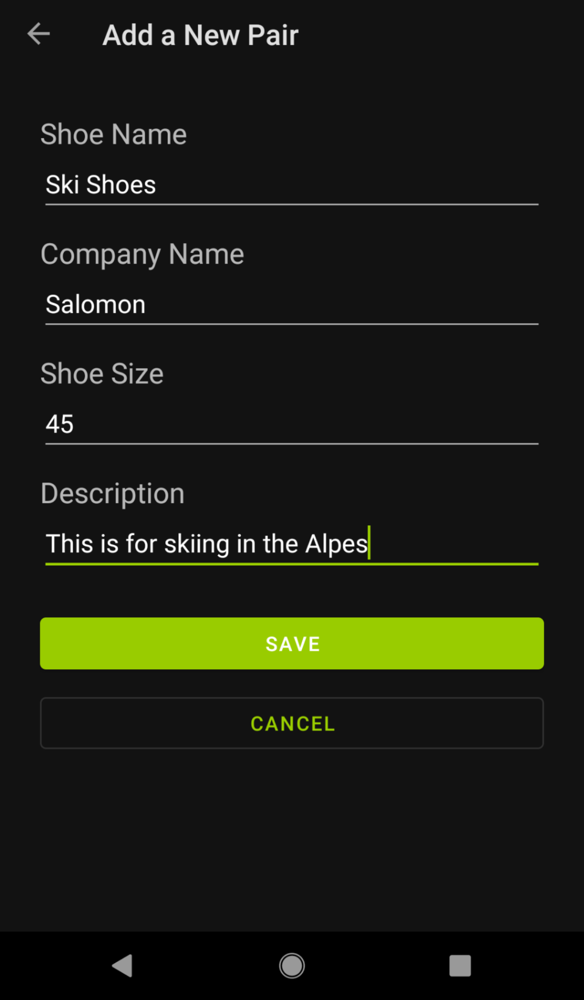

# Shoe Inventory

## Description

Shoe Inventory is an app that allows the user to manage a list of shoes, you can view all the data for each shoes (name, company, size, description).
The original idea of the app comes from Udacity Android Kotlin course.

The app consists of multiple screens: 
- A login screen (a fake one that does not perform real authentication) 
- a welcome & an instructions screen 
- a listing screen that displays the data in a scrollable list 
- a details screen that allows the user to add a new pair of shoes to the inventory

## Dependencies

The following components from the Jetpack library are used :
- ViewModel
- LiveData
- Data Binding
- Navigation
- RecyclerView

## Screenshots

 
 
 
 
 
